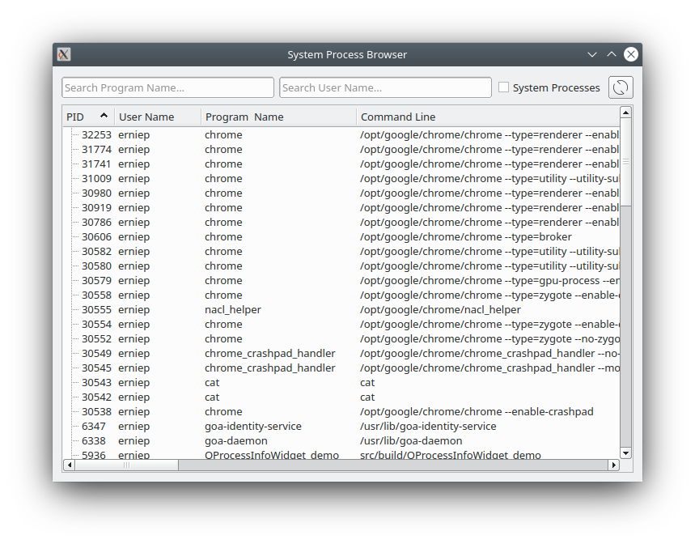
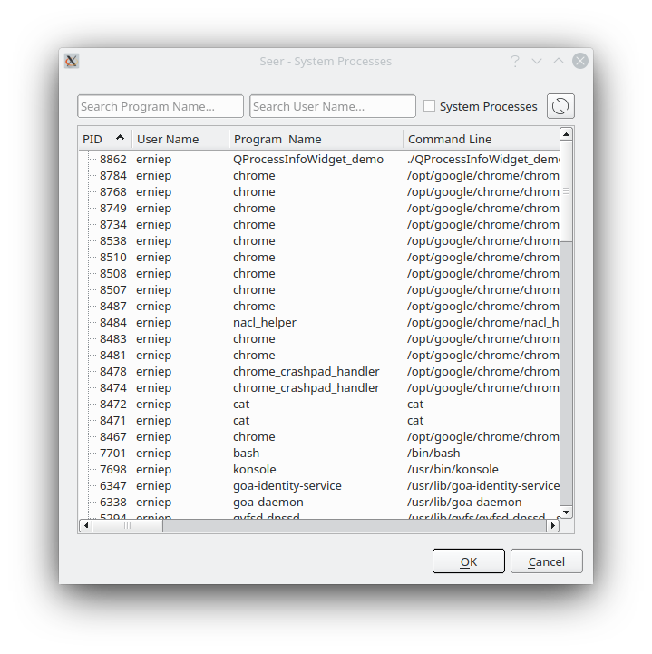

QProcessInfoWidget
==================

QProcessInfoWidget is a Qt widget to list processes running on your system.
It requires a /proc filesystem. So it is likely Linux only.

Select a process with a double-click of the process. A Qt signal is emitted.
There is a button to include/exclude system process.
There is a button to refresh the list.
You can do a wildcard search of username and/or program name.

Copy these files to your project.

    QProcessInfo.h
    QProcessInfo.cpp
    QProcessInfoWidget.h
    QProcessInfoWidget.cpp
    QProcessInfoDialog.h
    QProcessInfoDialog.cpp

Comes with a test program (main.cpp).

ScreenShot
==========

QProcessInfoWidget can be used as a basic widget to show running processes.

Or it can be used inside a QProcessInfoDialog dialog to select a running process pid.

Building QProcessInfoWidget
===========================

Download the latest code using 'clone'.

    % git clone https://github.com/epasveer/QProcessInfoWidget

Setup cmake and build

    % cd QProcessInfoWidget/src
    % cd build
    % cmake ..

    % make

Install it (or not), which will usually copy it to /usr/local/bin.
May need root access.

    % cd QProcessInfoWidget/src/build
    % sudo make install

LICENSE
=======

QProcessInfoWidget source code is licensed under the M.I.T. License.

